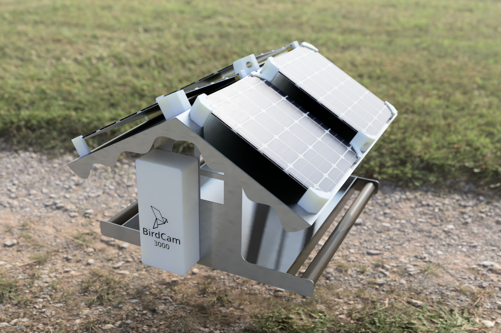

 # :bird: BirdCam3000
Solar powered camera for bird feeder.

### EN Project info bellow :arrow_down:

## :information_source:  Základné informácie 
Projekt popisuje použitie lacného modulu ESP-32 CAM, ako kameru ktorá sníma vtáčikov v kŕmidle umiestnenom na balkóne bytového domu. 
Riešenie je energeticky sebestačné, napájané štvoricou solárnych panelov. 

### :hammer: Hardwarové riešenie  
Samotná kamera používa objektív so širokouhlou optikou, tým je zabezpečená viditeľnosť širokého priestoru z krátkej vzdialenosti. 

Keďže doska ESP-32 je pomerne napäťovo hladná (cca 200mA pri vysielaní), plocha strechy nestačí na dostatočne veľké solárne panely, ktoré by dokázali napájať kameru aj po západe slnka. Kamera však nemá IR filter takže v noci nevidí. Preto som tento problém vyriešil modulom ktorý sa zopne po východe slnka čím pripojí kameru k batérií. Pre zvýšenie výdrže ESP-32 napájam z pinu 3V3 s použitím LDO 3,3V. Tento plánujem vymeniť za 3V, výdrž by mala byť ešte o niečo lepšia, ESP-32 dokáže podľa testov naštartovať zhruba pri 2,9V. 

Ako úložisko energie som použil 2x 18650 LiPo batérie zapojené paralelne k sebe, nabíjací obvod TP4056 so vstavaným ochranným obvodom pred podbitím batérie. Medzi solárnymi panelmi a nabíjacím obvodom je umiestnený ešte DC-DC boost modul ktorý zvyšuje napätie pri slabom osvetlení solárnych panelov. 

Na indikáciu stavu batérie bez potreby pripojenia modulu k wifi je v krabičke vstavaný LED indikátor nabitia batérie.

### :atom: Software
Základný program v kamere je ESPHome, kamera komunikuje cez WiFi do riadiaceho systému HomeAssistant. Pod HomeAssistantom je nainštalovaný addon Frigate NVR ktorý umožňuje detekciu objektov z videa pomocou naučených modelov umelej inteligencie. 

Verejná stránka je jednoduchý web založený na Bootstrap 5 frameworku. Aby som sa vyhol sprístupneniu celého API verejnosti, používam NGINX Proxy Manager ktorý presmerováva požiadavky na konkrétne systémy v lokálnej sieti. Webová stránka dotazuje Nginx, ktorý cez Frigate API vracia aktuálny obrázok kamery a tiež historické snímky na ktorých bol detegovaný objekt, v našom prípade vták. Pre zobrazenie aktuálnej teploty a atmosférických podmienok používam HTTP Endpoint v NodeRED ktorý informácie z HomeAssistantu transformuje do JSON odpovede, ktorá sa zobrazuje na webe. 

### :pencil2: Dizajn
Rozloženie, obrázky a celkovú kompozíciu webu som vygeneroval umelou inteligenciou cez službu MidJourney. Jednotlivé časti obrázkov poskladal a usporiadal v Photoshope. 

Časti zdrojového kódu webu ktorý má na starosti načítavanie aktuálneho obrázku z kamery, ako aj zobrazenie počasia, napísala taktiež umelá inteligencia, cez službu ChatGPT. 

### :ice_cube: Krabička
Všetky súbory pre uloženie komponentov sú dostupné v zložke 3D-files. Súčasťou krabičky je integrovaný tunel pre binderku ktorá zabezpečuje batérie pred pohybom. Pre jednoduchšiu tlač je kryt kamery a svetelného senzoru vytlačená zvlášť a spolu sú prichytené sekundovým lepidlom. 
