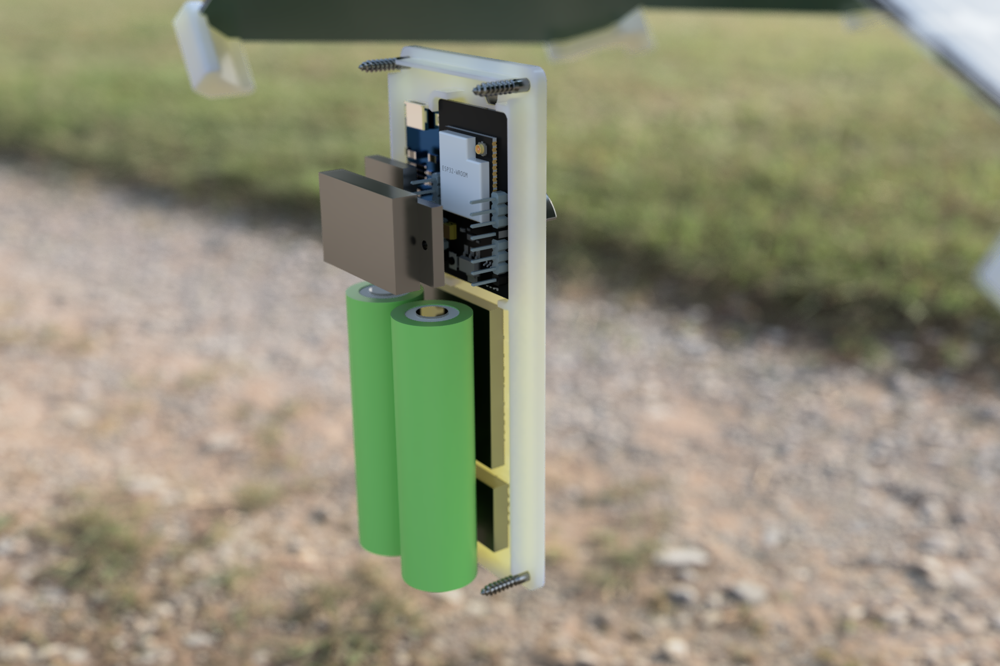
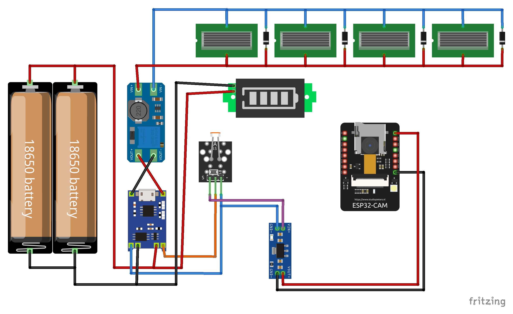
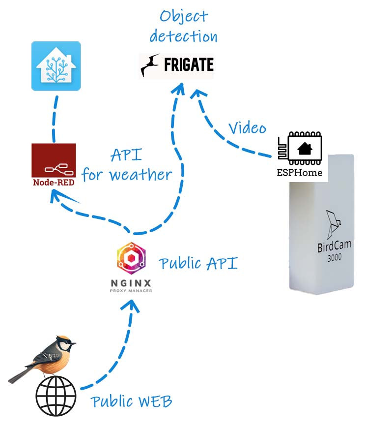
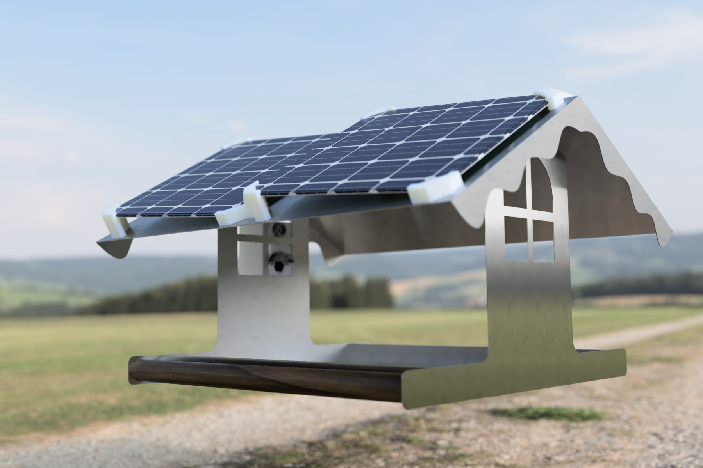
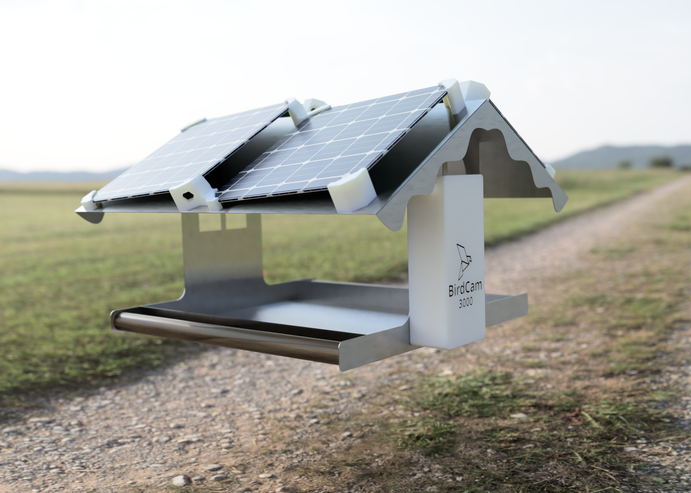

 # :bird: BirdCam3000
Energeticky sebestačná kamera pre vtáčie kŕmidlo
Solar powered camera for bird feeder.

### :link: EN Project [info bellow](#english), :arrow_down:

## :information_source:  Základné informácie 
Projekt popisuje použitie lacného modulu ESP-32 CAM, ako kameru ktorá sníma vtáčikov v kŕmidle umiestnenom na balkóne bytového domu. 
Riešenie je energeticky sebestačné, napájané štvoricou solárnych panelov. 

### :hammer: Hardwarové riešenie  
Samotná kamera používa objektív so širokouhlou optikou, tým je zabezpečená viditeľnosť širokého priestoru z krátkej vzdialenosti. 

Keďže doska ESP-32 je pomerne napäťovo hladná (cca 200mA pri vysielaní), plocha strechy nestačí na dostatočne veľké solárne panely, ktoré by dokázali napájať kameru aj po západe slnka. Kamera však nemá IR filter takže v noci nevidí. Preto som tento problém vyriešil modulom ktorý sa zopne po východe slnka čím pripojí kameru k batérií. Pre zvýšenie výdrže ESP-32 napájam z pinu 3V3 s použitím LDO 3,3V. Tento plánujem vymeniť za 3V, výdrž by mala byť ešte o niečo lepšia, ESP-32 dokáže podľa testov naštartovať zhruba pri 2,9V. 

Ako úložisko energie som použil 2x 18650 LiPo batérie zapojené paralelne k sebe, nabíjací obvod TP4056 so vstavaným ochranným obvodom pred podbitím batérie. Medzi solárnymi panelmi a nabíjacím obvodom je umiestnený ešte DC-DC boost modul ktorý zvyšuje napätie pri slabom osvetlení solárnych panelov. 

Na indikáciu stavu batérie bez potreby pripojenia modulu k wifi je v krabičke vstavaný LED indikátor nabitia batérie.

### :atom: Software
Základný program v kamere je ESPHome, kamera komunikuje cez WiFi do riadiaceho systému HomeAssistant. Pod HomeAssistantom je nainštalovaný addon Frigate NVR ktorý umožňuje detekciu objektov z videa pomocou naučených modelov umelej inteligencie. 

Verejná stránka je jednoduchý web založený na Bootstrap 5 frameworku. Aby som sa vyhol sprístupneniu celého API verejnosti, používam NGINX Proxy Manager ktorý presmerováva požiadavky na konkrétne systémy v lokálnej sieti. Webová stránka dotazuje Nginx, ktorý cez Frigate API vracia aktuálny obrázok kamery a tiež historické snímky na ktorých bol detegovaný objekt, v našom prípade vták. Pre zobrazenie aktuálnej teploty a atmosférických podmienok používam HTTP Endpoint v NodeRED ktorý informácie z HomeAssistantu transformuje do JSON odpovede, ktorá sa zobrazuje na webe. 

### :pencil2: Dizajn
Rozloženie, obrázky a celkovú kompozíciu webu som vygeneroval za pomoci umelej inteligencie cez službu MidJourney. Jednotlivé časti obrázkov som upravil, poskladal a usporiadal v Photoshope. 

Časti zdrojového kódu webu ktorý má na starosti načítavanie aktuálneho obrázku z kamery, ako aj zobrazenie počasia, napísala taktiež umelá inteligencia, cez službu ChatGPT. 

### :ice_cube: Krabička
Krabička pre uloženie komponentov, ako aj držiaky solárnych panelov sú dostupné v zložke 3D-files. Súčasťou krabičky je integrovaný tunel pre binderku ktorá zabezpečuje batérie pred pohybom. Pre jednoduchšiu tlač je kryt kamery a svetelného senzoru vytlačená zvlášť a spolu sú prichytené sekundovým lepidlom. 
Pre vyššiu odolnosť pôsobením vonkajších vplyvov odporúčam krabičku tlačiť z PET-G alebo podobného materiálu.

## :information_source:  Basic informations
In this project I use cheap ESP-32 CAM module as camera for capturing birds in birds feeder, placed at balcony of our building. 
Solution is self powered with help of 4 solar panels mounted to the roof. 

### :hammer: Hardware 
To be able to view whole internal part of bird feeder from relatively shor distance, I found 160 degrees fish eye lens for ESP-32. 

ESP-32 is quite power hungry for battery operated solutions (cca 200mA while transmitting), there is no enough space for bigger solar panels on the roof. But the camera module doesn't have IR filter so we don't need to broadcast at night. 
I solved this problem with cheap light dependend module switch, which will turn on power to the camera after sunrise. 
For better battery life I fed the ESP-32 module through 3V3 pin, using LDO AMS1117. I am planning to switch this to 3V LDO and prolong the battery life even a bit more. From my tests, my ESP-32 can boot sucessfully from about 2,9V.

For energy storage I used 2x 18650 LiPo batteries, I harvested from old laptops. They are connected in parallel to gain capacity. For charging there is TP4056 module with integrated protection for battery undervolage and overvoltage cutout. 
Between solar panels and charger there is also DC-DC boost module to slightly increase voltage in cases there is not enough sunlinght. 
As visual battery indicator without need to be connected to WiFi, there is LED battery indicator module built in to the case.

### :atom: Software
Camera runs on basic ESPHome firmware, it sends data through WiFi to the HomeAssistant. Under HomeAssistant there is addon called Frigate NVR, which is capable of detecting objects from video using pre-learned AI models.

Public WEB is simple website based on Bootstrap 5 framework. I don't wanted to exposed whole HomeAssistant, NodeRED, or Frigate API to the public internet, So I used NGINX Proxy manager as redirector for API calls from outside my network. 
Public web is requesting NGINX Proxy, which grabs actual image from Frigate, and also historical snapshots with detected objects, in our case birds, and shows it on the web. There is also API for loading outside temperature and humidity, this call handles HTTP Node in NodeRED, which asks HomeAssistant for data, encode response to JSON and sends it back.

### :pencil2: Design
Overall design, composition, images and birds were generated through AI, with MidJourney. Later I cleaned, aligned and edited all images in Photoshop.

Parts of code of public web page, reponsible for loading and showing actual camera image, as well as loading of weather, was too written with help of AI, using ChatGPT.

### :ice_cube: 3D printed case
All 3D files for case for electronics as well as mounting of solar panels, are in 3D-files folder. 
There is integrated slot for zip tie under the batteries so you can secure them inside the case. 
For ease of print I splitted some parts of front cover as camera cover and LDR cover to separate files, these can be stitched together with drop of superglue.

To prolong case life in the wild, I suggest to use PET-G or similar material for printing the case.

### :page_facing_up: Zoznam komponentov / BOM

* [ESP32-CAM module](https://www.aliexpress.com/item/4000348799276.html?spm=a2g0o.order_list.order_list_main.30.4c061802zXo1zr)
* [ESP32-CAM 160 Degree fisheye lens](https://www.aliexpress.com/item/1005004781691725.html?spm=a2g0o.order_list.order_list_main.5.4c061802zXo1zr)
* [DC-DC Boost module](https://www.aliexpress.com/item/4000283425849.html?spm=a2g0o.order_list.order_list_main.67.4c061802zXo1zr)
* [18650 Battery](https://www.aliexpress.com/item/1005004738197878.html?spm=a2g0o.productlist.main.3.6258184f7TppDP&algo_pvid=e26e0aee-ede6-42d6-9d41-d7575a1d2422&algo_exp_id=e26e0aee-ede6-42d6-9d41-d7575a1d2422-1&pdp_ext_f=%7B%22sku_id%22%3A%2212000030294740216%22%7D&pdp_npi=3%40dis%21EUR%219.47%214.27%21%21%21%21%21%40210213c816776870512202271d071e%2112000030294740216%21sea%21SK%21136306844&curPageLogUid=xehQWcii4VON)
* [TP4056 Charger with protection](https://www.aliexpress.com/item/1005004968770726.html?spm=a2g0o.order_list.order_list_main.87.4c061802zXo1zr)
* [External Antenna](https://www.aliexpress.com/item/1005001594173833.html?spm=a2g0o.order_list.order_list_main.259.4c061802zXo1zr)
* [Battery indicator](https://www.aliexpress.com/item/32851338868.html?spm=a2g0o.order_list.order_list_main.140.4c061802zXo1zr)
* [Light Sensor switch module](https://www.aliexpress.com/item/1005004305784785.html?spm=a2g0o.order_list.order_list_main.305.4c061802zXo1zr)
* [AMS1117 LDO](https://www.aliexpress.com/item/32732025305.html?spm=a2g0o.productlist.main.3.1b363674DIoH1K&algo_pvid=b8366f1d-0162-48b0-9f18-bba4cae3270b&algo_exp_id=b8366f1d-0162-48b0-9f18-bba4cae3270b-1&pdp_ext_f=%7B%22sku_id%22%3A%2212000028154574889%22%7D&pdp_npi=3%40dis%21EUR%210.64%210.55%21%21%21%21%21%40211beca116776872496876601d0703%2112000028154574889%21sea%21SK%21136306844&curPageLogUid=fAdGqaDpJNAy)
* [Schottky diode 12SQ045 12A 45V](https://www.aliexpress.com/item/1005004170936042.html?spm=a2g0o.order_list.order_list_main.407.4c061802zXo1zr)
* [145x145mm Solar panel](https://www.aliexpress.com/item/1005004580239797.html?spm=a2g0o.order_list.order_list_main.362.4c061802zXo1zr) (Pozor, reálne má polovičný výkon ako reklamovaných 550mA / Watchout, only half of stated 550mA is real)

### :framed_picture: Gallery

## If you liked my work, you could buy me a coffee :)

### Or send some crypto

	
				